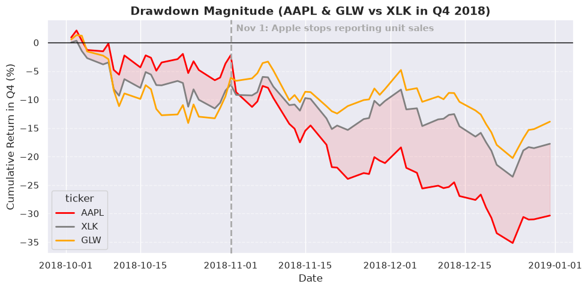
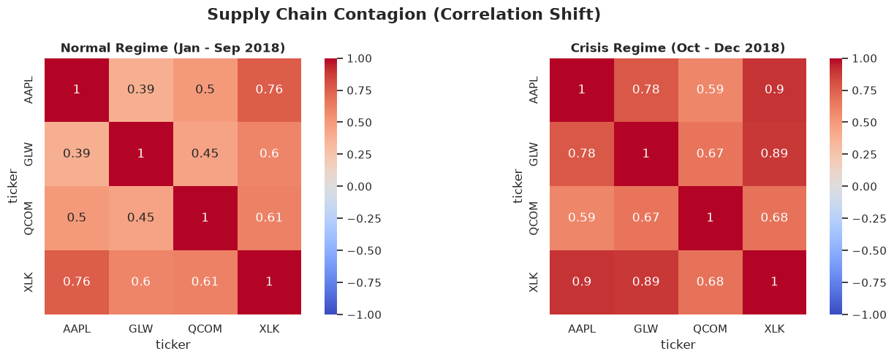
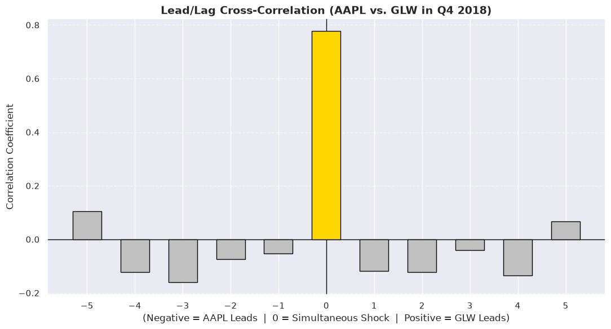
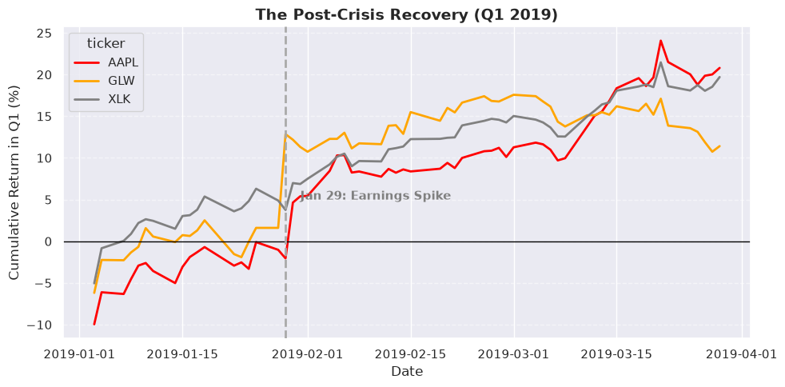

# 🍎 Financial Supply Chain Ripple Analysis

An exploratory financial data science project investigating whether Apple's 2018 stock-price shock was reflected across related upstream companies, how those movements evolved relative to the broader technology sector, and whether the observed relationships were **synchronous, lagged, or primarily explained by broader market conditions**.

The project combines **Python time-series analysis, PostgreSQL data management, SQL validation, financial EDA, correlation analysis, lead-lag analysis, relative performance analysis, volume analysis, and post-event recovery analysis**.

---

## 🔎 Project Overview

In late 2018, Apple experienced a sharp deterioration in market sentiment amid concerns surrounding iPhone demand, pricing, and the company's outlook.

Because major companies are connected through complex supply chains and financial markets, a natural question follows:

> **When a major company experiences a severe market shock, does that shock appear later in economically related companies—or do the companies move together as part of a broader market repricing?**

This project investigates that question through a focused case study of Apple and two companies associated with its upstream ecosystem:

- **Apple (AAPL)** — focal company
- **Qualcomm (QCOM)** — upstream semiconductor relationship
- **Corning (GLW)** — upstream component relationship
- **XLK** — technology-sector benchmark

The analysis covers approximately **2017 through early 2020**, providing a pre-event baseline, the 2018 shock period, and the subsequent recovery.

Rather than treating correlation as proof of causation, the project separates:

**Observed market behavior → statistical relationships → contextual interpretation → analytical limitations**

---


## 🎯 Research Questions

The analysis is designed around five questions:

1. **Did Apple and the selected upstream companies decline around the same period?**
2. **Did the price movement appear to propagate with a measurable lag?**
3. **How did the relationships between the companies change during the 2018 crisis period?**
4. **Was the decline specific to Apple's ecosystem, or was it part of a broader technology-sector selloff?**
5. **How did the companies behave during the subsequent recovery?**

---

## 📊 Assets & Analytical Roles

| Ticker | Company / Asset | Role in Analysis |
|:---:|---|---|
| **AAPL** | Apple | Focal company |
| **QCOM** | Qualcomm | Upstream semiconductor relationship |
| **GLW** | Corning | Upstream component relationship |
| **XLK** | Technology Select Sector SPDR Fund | Sector benchmark |

### Why XLK?

XLK provides a reference point for distinguishing company- or ecosystem-specific movements from broader technology-sector weakness.

It is **not treated as an independent control**, because Apple itself is a constituent of the ETF.

---

## 🧭 Analytical Approach

```text
Historical Market Data
        ↓
Data Validation & Integrity Checks
        ↓
PostgreSQL Storage
        ↓
SQL Validation / Exploration
        ↓
Python Data Preparation
        ↓
Return Calculation
        ↓
Event / Crisis Identification
        ↓
Cross-Asset Comparison
        ↓
Correlation Analysis
        ↓
Lead-Lag Analysis
        ↓
Relative Performance
        ↓
Trading Volume Analysis
        ↓
Recovery Analysis
        ↓
Interpretation & Limitations
```

This separation allows the project to use:

- **SQL for data management and validation**
- **Python for statistical analysis and visualization**
- **domain context for interpretation**

---

## 🗃️ Data Engineering & Architecture

The project uses a small but deliberate data pipeline rather than relying entirely on a single notebook.

### Data ingestion

Historical OHLCV market data for AAPL, QCOM, GLW, and XLK is retrieved through the `yfinance` API.

The repository includes a dedicated ingestion script:

```text
scripts/
└── Fetch_Data.py
```

### PostgreSQL layer

The financial data is structured and validated through PostgreSQL.

```text
sql/
├── schema.sql
├── load_csv.sql
└── data_validation.sql
```

The SQL layer keeps database design, loading, and validation separate from the analytical notebook.

### Data validation

Validation includes checks for:

- duplicate observations
- missing values
- expected ticker coverage
- date integrity
- OHLC relationships
- valid market observations

---

## 🧮 Data Transformation & Derived Metrics

The raw market data is preserved separately from derived analytical data.

For time-series comparison, the dataset is reshaped into wide-format price matrices using Pandas:

```python
price_df = market_df.pivot(
    index="trade_date",
    columns="ticker",
    values="adj_close"
)
```

Trading volume is maintained separately so that price and activity analysis remain conceptually distinct.

Daily returns are calculated from adjusted closing prices:

```python
daily_returns = price_df.pct_change().dropna()
```

Adjusted close is used for return analysis so that corporate actions such as splits and dividends are incorporated into the price series.

---

## 📈 Analysis Performed

### 1. Long-Run Market Context

The project first examines the broader 2017–2020 period to establish normal-period behavior, the 2018 decline, and post-event recovery.

### 2. Crisis-Period Analysis

The Q4 2018 cumulative performance in the notebook is approximately:

| Asset | Q4 2018 Cumulative Change |
|---|---:|
| **AAPL** | **−35.17%** |
| **XLK** | **−23.54%** |
| **GLW** | **−20.27%** |

This establishes that Apple experienced a substantially larger decline than both Corning and the broader technology benchmark.

### 3. Correlation Regime Analysis

The notebook finds a substantial increase in short-term co-movement between AAPL and GLW during Q4 2018:

| Relationship | Jan–Sep 2018 | Q4 2018 |
|---|---:|---:|
| **AAPL ↔ XLK** | ~0.76 | ~0.90 |
| **AAPL ↔ GLW** | ~0.39 | ~0.78 |

The conclusion is that the market relationship between Apple and Corning became substantially stronger during the crisis period—not that correlation by itself identifies the causal mechanism.

### 4. Lead-Lag Analysis

Cross-correlations are calculated across shifted return series to test whether one asset systematically moves before the other.

The strongest relationship occurs around **lag 0**, suggesting predominantly contemporaneous movement rather than a clear multi-day delayed response.

### 5. Relative Performance

Each company is compared with XLK to distinguish sector-wide weakness from materially different company-level performance.

### 6. Trading Volume

Trading volume is examined alongside price movements to identify periods of unusually high market activity. Volume is treated as evidence of activity, not as direct identification of institutional or algorithmic traders.

### 7. Post-Event Recovery

The project continues into Q1 2019 to examine whether the relationships persisted or weakened as new company-specific information entered the market.
---
## 📌 Key Visual Findings

### Q4 2018: The Drawdown

The crisis window shows Apple falling substantially more than both Corning and the technology-sector benchmark.



*Q4 2018 cumulative performance for AAPL, GLW, and XLK. The vertical marker denotes the November 1 event used in the notebook.*

### Correlation Shift

The relationship between Apple and Corning strengthened markedly during the crisis period.



*Pairwise return correlations across the normal and crisis regimes. AAPL–GLW increases from approximately 0.39 to 0.78.*

### Lead-Lag Analysis

The strongest AAPL–GLW relationship occurs around lag 0, with no clear multi-day lead/lag pattern dominating the Q4 window.



*Cross-correlation between AAPL and GLW daily returns for lags −5 through +5.*

### Post-Crisis Recovery

The analysis continues into Q1 2019 to examine whether the assets continued moving together or began to separate during recovery.



*Q1 2019 cumulative returns for AAPL, GLW, and XLK, with the January 29 earnings marker shown in the notebook.*

---

---

## 🧠 Key Findings

### 1. Apple experienced a materially larger decline than the technology benchmark

AAPL fell approximately **35.17%** during the identified Q4 2018 crisis window, compared with approximately **23.54% for XLK**.

### 2. Apple and Corning became much more closely synchronized

AAPL–GLW correlation increased from approximately **0.39 before the crisis window to 0.78 during Q4 2018**.

### 3. The observed relationship was predominantly contemporaneous

Lead-lag analysis does not show a strong multi-day delayed response in which Apple's returns consistently precede Corning's returns.

### 4. Sector-wide weakness explains part—but not all—of the movement

XLK also declined sharply. The result should therefore be interpreted as a combination of broad technology weakness, Apple-specific pressure, and company-specific factors rather than a single isolated causal chain.

### 5. Market repricing and operating exposure are not the same thing

A diversified supplier's stock-price decline should not automatically be interpreted as a proportional decline in its underlying business. The project uses relative performance and recovery behavior to examine this distinction.

### 6. Qualitative business context matters

The analysis also highlights how changing supplier relationships can materially affect interpretation. Quantitative models can misclassify relationships when the underlying business context changes during the event window.

---

## 🛠️ Technologies

### Programming & Analysis
- Python 3
- Pandas
- NumPy
- Matplotlib
- Seaborn

### Database & SQL
- PostgreSQL
- SQLAlchemy
- SQL

### Financial Data
- `yfinance`
- Historical OHLCV market data

### Environment
- Jupyter Notebook

---

## 📁 Repository Structure

```text
Financial-Supply-Chain-Ripple-Analysis/
│
├── data/
│   └── raw/
│       └── market_data.csv
│
├── figures/
│   ├── q4_drawdown.png
│   ├── correlation_shift.png   
│   ├── lead_lag.png    
│   └── recovery_q1_2019.png    
│       
│
├── notebooks/
│   └── Ripple_Effect_Analysis.ipynb
│
├── scripts/
│   └── Fetch_Data.py
│
├── sql/
│   ├── schema.sql
│   ├── load_csv.sql
│   └── data_validation.sql
│
├── .gitignore
├── LICENSE
├── requirements.txt
└── README.md
```

---

## 🚀 Reproducibility

The repository separates the major stages of the workflow:

**Data acquisition**

```text
scripts/Fetch_Data.py
```

**Database creation and loading**

```text
sql/schema.sql
sql/load_csv.sql
```

**Validation**

```text
sql/data_validation.sql
```

**Analysis**

```text
notebooks/Ripple_Effect_Analysis.ipynb
```

This structure keeps ingestion, storage, validation, visualization, and analysis from becoming a single monolithic notebook.

---

## 📌 Limitations

### Focused supply-chain sample

The analysis examines only a small subset of Apple's broader ecosystem and should not be interpreted as a representation of Apple's entire supply chain.


---

## 💡 What This Project Demonstrates

This project was built to demonstrate more than the ability to create financial charts.

It combines:

**Data Engineering** → ingestion, database design, SQL validation, structured storage

**Data Analysis** → transformation, returns, correlation, relative performance, volume

**Time-Series Reasoning** → event windows, synchronization, lead-lag relationships, recovery

**Domain Reasoning** → supply-chain relationships, sector effects, company-specific context

**Analytical Communication** → separating observations, interpretations, hypotheses, and limitations

> **A stock-price movement can reveal market expectations about a business relationship, but market correlation alone does not reveal the mechanism behind it.**

---

## 📖 Project Status

**Completed — Exploratory Analysis**

The repository contains the data-ingestion pipeline, PostgreSQL/SQL layer, validation logic, analytical notebook, and documented findings.

The project can serve as a foundation for a future, more rigorous event-study or factor-model analysis.

---

## ⭐ Summary

This project investigates the **financial ripple effects of Apple's 2018 market shock** across selected upstream companies.

Rather than assuming synchronized price movements automatically imply supply-chain causation, it examines:

- **magnitude**
- **timing**
- **correlation**
- **lead-lag behavior**
- **sector-relative performance**
- **trading activity**
- **post-event recovery**

The result is a focused case study in how **financial markets, supply-chain relationships, and investor expectations interact during a major corporate shock**.
